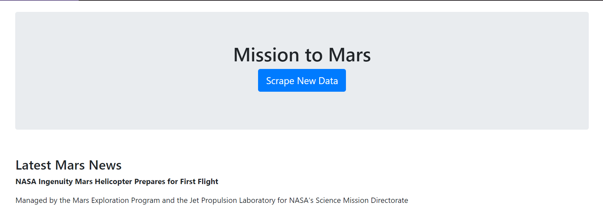
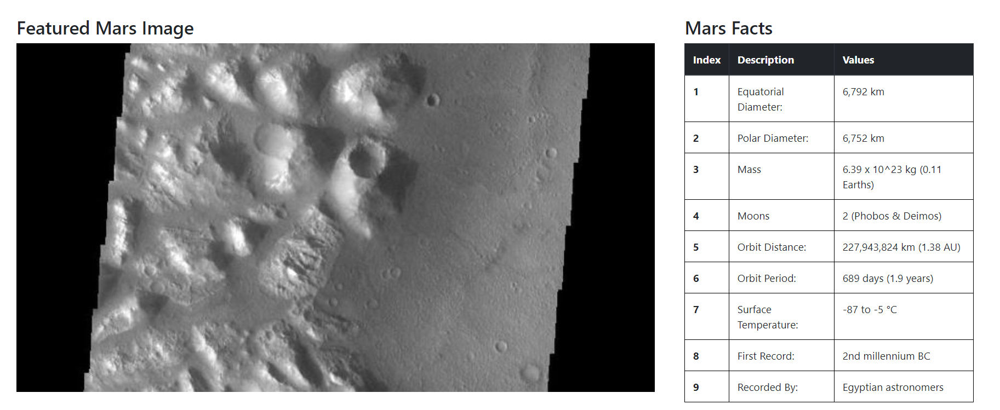

# Mission to Mars

This project will build a web application that scrapes various websites for data related to the Mission to Mars and displays the information in a single HTML page. The following outlines the entire process of the project:

## Step 1 - Scraping

### NASA Mars News

* Scraped the [NASA Mars News Site](https://mars.nasa.gov/news/) and collected the latest News Title and Paragraph Text. 

## Step 2 - MongoDB and Flask Application

MongoDB with Flask was used to create a new HTML page that displays all of the information that was scraped from the URLs above. Below are images to my developed HTML page

